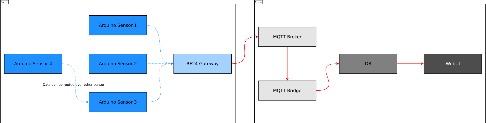

# Radio sensors NET
## Introduction
This project will allow to aggregate, process and visualise data collected from
a network of wireless sensors. Main purpose of it is to use it as a base of my
own smart home system.

Probably you are lost if you are reading this README. The project is still in a
hacking phase. I check different possible solutions and ways to proceed. Don't
expect anything.

Check [Issues][3] for TODO.

This README for now is just my notebook. It will get a shape later.

## Used resources
This project heavily utilizes [RF24][1] libs.

MQTT usage is implemented with [PubSubClient][4] library.


## What works so far
1. Prototype of a arduino-based hardware.
2. Publishing of temperature and humidity data.
3. Arduino can be configured over serial connection.
4. BeagleBone Black with RF24Gateway properly transfers MQTT data from sensors to [Mosquitto][7] MQTT broker.

## System architecture


The system consists of: 

* Radio part
	1. Sensor layer
	2. RF24 Gateway
  
* Cloud part
	1. MQTT Broker
	2. MQTT to DB bridge
	3. Database
	4. Presentation layer (WebUI)

### Radio part
#### Sensor layer

##### Hardware limitations
###### Arduino flash size problems
Initially, sensor used MQTT subscriptions as alternative way to set configuration data.
Unfortunatelly, RF24 Ethernet library is quite heavy for arduino in terms of code size.

###### Arduino TCP stack performance
Take a look at the [RF24Ethernet issue #17][5] and [PubSubClient issue #216][6]. Probably
arduino is not able to handle to many task at the same time - especially publishing and
receiving  notification about subscribed topics.

TODO: It should be checked whether similar problems are occuring when using ethernet shield.


##### DHT22
Used library: https://github.com/RobTillaart/Arduino/tree/master/libraries/DHTlib

##### MQTT topic architecture
```
r/l/<location: char[8]>/s/<id: uint8_t>/t - temperature
r/l/<location: char[8]>/s/<id: uint8_t>/h - humidity
r/l/<location: char[8]>/s/<id: uint8_t>/v - voltage
```
##### Serial console
There are two types of commands which can be executed over serial console:

###### SET commands
```
S,<name>,<value>
```  
Modifies given variable in the system. Where ```<name>``` is:

* **id**: uint8_t - sensor id
* **loc**: char[8] - sensor location
* **sip**: ipaddress - sensor ip address
* **gip**: ipaddress - rf24 gateway ip address
* **bip**: ipaddress - MQTT broker ip address

###### GET commands
```
G,<name>
```
 
Prints given variable. Where ```<name>``` is:

* **id**: uint8_t - sensor id
* **loc**: char[8] - sensor location
* **sip**: ipaddress - sensor ip address
* **gip**: ipaddress - rf24 gateway ip address
* **bip**: ipaddress - MQTT broker ip address

#### RF24 Gateway
### Cloud part
#### MQTT Broker
#### MQTT to DB bridge
Python based bridge build with [Paho-MQTT][8].
#### Database
#### Presentation layer (WebUI)

[1]: https://github.com/TMRh20
[2]: https://tmrh20.blogspot.se/
[3]: https://bitbucket.org/elvisPA/radiosensornet/issues
[4]: https://github.com/knolleary/pubsubclient
[5]: https://github.com/TMRh20/RF24Ethernet/issues/17
[6]: https://github.com/knolleary/pubsubclient/issues/216
[7]: https://mosquitto.org/
[8]: https://pypi.python.org/pypi/paho-mqtt/1.2
